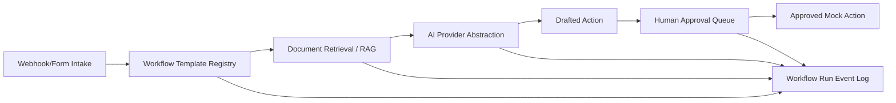

# OpsPilot AI — AI Operations Workflow Console

Portfolio owner/public name: **Fredy Gimenez**  
Role positioning: **AI Workflow Automation Developer**

OpsPilot AI is a production-style portfolio demo for AI workflow automation work. It receives business events, retrieves company knowledge, proposes AI-assisted next actions, and keeps a human approval step before external actions.

> Honest status: this public V1 is a deployable demo shell with seeded data and mocked external actions. It is designed to show architecture, UI quality, workflow reasoning, and implementation direction without pretending to be a production SaaS.

## Public demo

- Vercel URL: https://opspilot-ai-gamma.vercel.app
- GitHub URL: _added after publish_
- Stitch project: `projects/4373726541519858586`
- Stitch design system: `assets/8921000560763558236`

## What the demo shows

- Workflow dashboard for SaaS operations
- Three workflow templates:
  - Support refund triage
  - Lead qualification
  - Internal policy Q&A
- Mock intake endpoint: `POST /api/intake/demo`
- RAG-style retrieved policy snippets with citations
- Drafted AI response/output
- Human approval queue: edit, approve, reject
- Run event logs and token/cost estimate
- Knowledge base with seeded Northstar Ops documents
- Portfolio-safe AI provider settings

## Stack

Frontend:

- Next.js
- React
- TypeScript
- CSS design tokens inspired by Google Stitch output
- Vercel deployment

Backend skeleton:

- Python
- FastAPI
- Pydantic
- SQLModel/SQLAlchemy-ready architecture
- Document/RAG/workflow/approval modules planned

## Architecture



## Seed company

Fictional company: **Northstar Ops**

Seed documents:

- Refund Policy v2.1
- Pricing Tiers 2024
- Onboarding SOP
- Support Escalation Policy
- Lead Qualification Rules

## Local setup

```bash
npm install
npm run dev
```

Open:

```txt
http://localhost:3000
```

Build check:

```bash
npm run typecheck
npm run build
```

## Demo script

1. Open the dashboard.
2. Click **Trigger refund demo**.
3. Review original intake, retrieved policy snippets, classification, reasoning summary, and drafted response.
4. Edit the draft.
5. Approve or reject it.
6. Open **Pending Approvals** to show the queue.
7. Open **Knowledge Base** to show source documents and indexed chunks.
8. Explain that external actions are disabled in the public demo for safety.

## Case-study paragraph

OpsPilot AI models a common SaaS operations problem: teams want AI to speed up support, sales, and internal workflows, but they cannot allow unsupervised external actions. The demo shows a safer pattern: business-event intake, grounded retrieval from company policy documents, AI-generated recommendations, human approval, and auditable logs.

## Proposal paragraph

I recently built OpsPilot AI, a production-style AI workflow console using Next.js, TypeScript, a FastAPI-ready backend architecture, RAG-style document retrieval, webhook intake, workflow logs, and human-in-the-loop approvals. It is designed for SaaS and operations teams that need reliable AI-assisted workflows rather than a simple chatbot.

## Known limitations

- Public V1 uses seeded/mock outputs; no real provider key is needed.
- External actions such as email sending are intentionally disabled.
- The FastAPI backend is included as a skeleton and can be completed for a client deployment.
- Vector storage is represented in the UI and architecture; pgvector/Chroma wiring is planned for the next iteration.
- No billing, multi-tenant permissions, or production CRM integration in V1.
